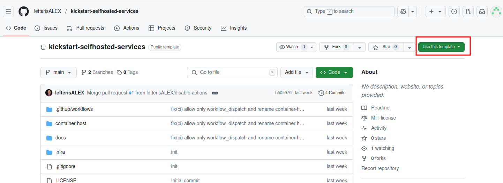
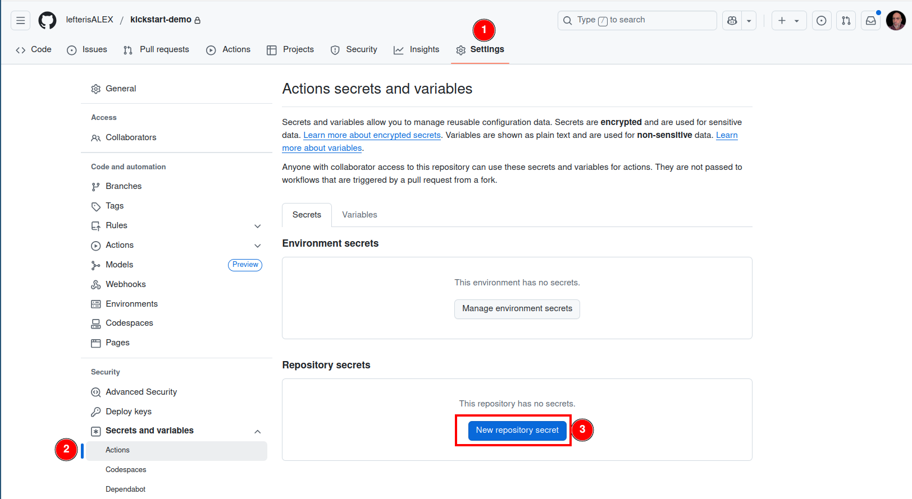
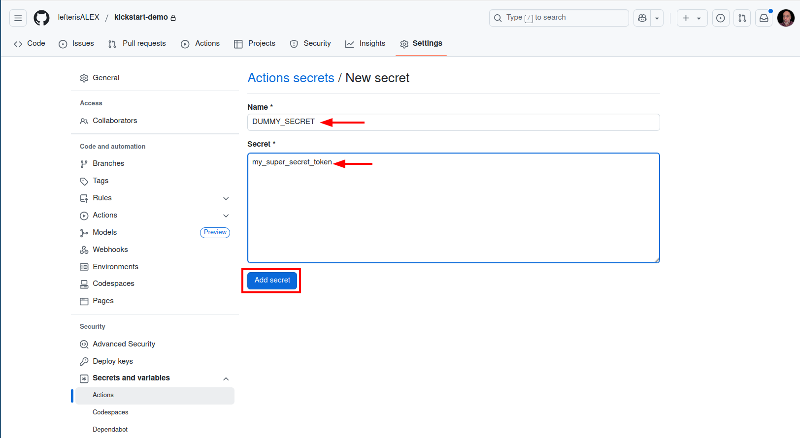
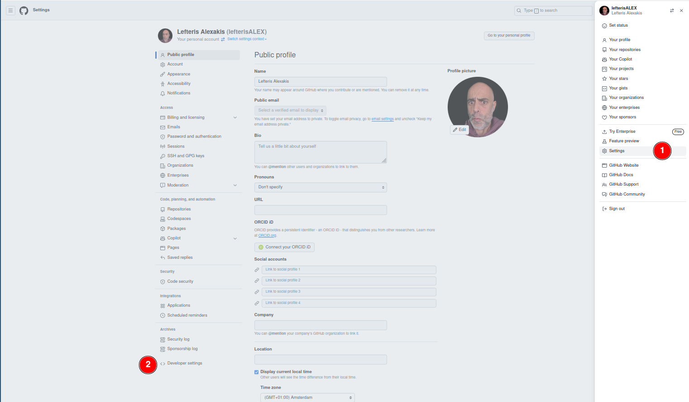
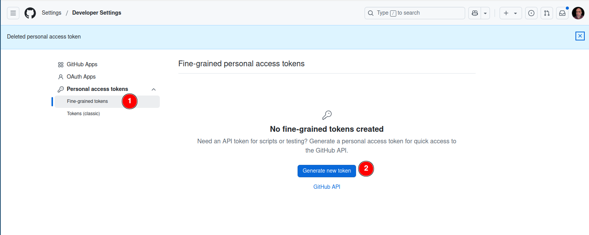
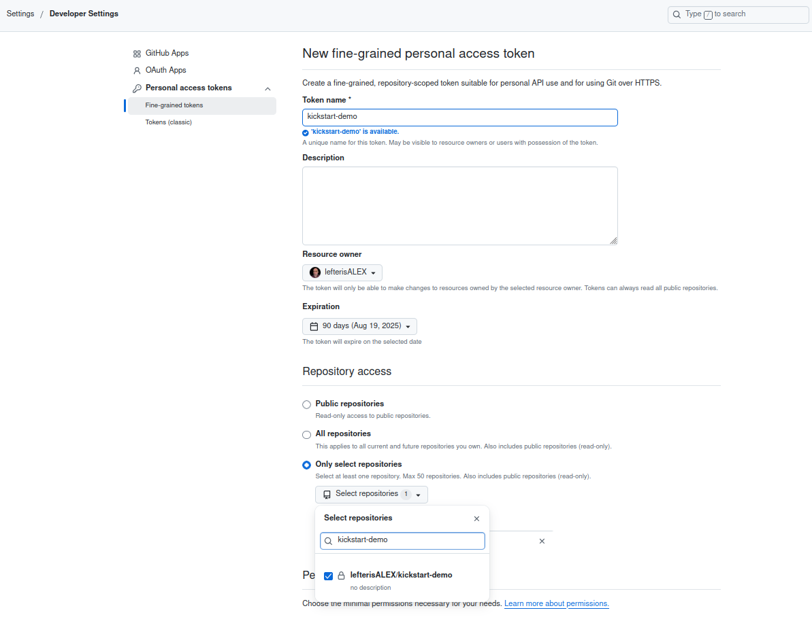
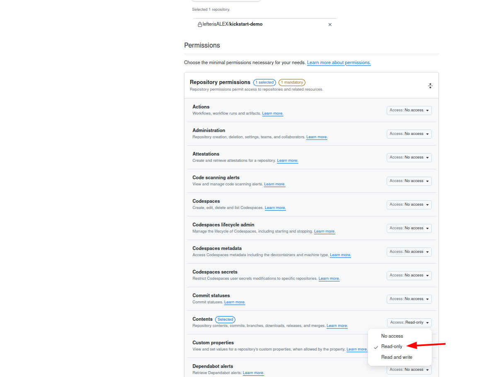
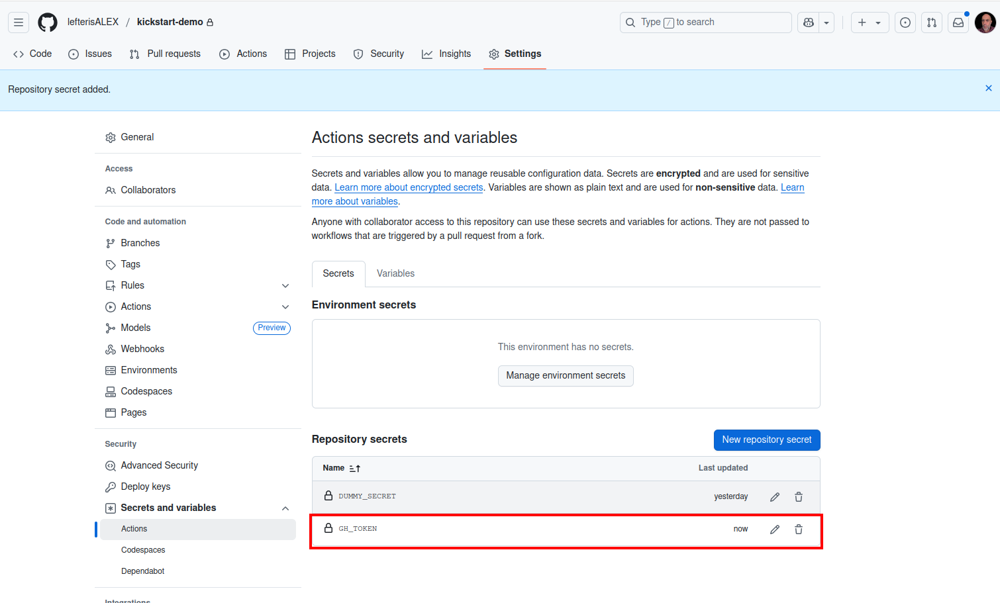

# CICD

## What we use?

The following guide is going though the required preparation steps that you will need before you first run your pipeline to deploy your selfhosted services. We are using Github and Github Actions for that.

## Use of kickstart template

1. Go to [kickstart-selfhosted-services](../..tps://github.com/lefterisALEX/kickstart-selfhosted-services) repository and press "Use this template" to create a new repository based on this template repository.  

2. Clone the new repository to your laptop/desktop.  

## Github Secrets {#github-secret}
During this setup we will need to store and use some sensitive information during the pipeline execution. Think of API keys for services like Hetzner, Tailscale etc. GitHub provides a feature called "Secrets & Variable" that allows you to store sensitive data, such as API keys, passwords, and tokens, securely within your repository.

**example of creating dummy secret**  
To create a dummy secret in your newly created GitHub repository, navigate to the repository on GitHub and click on the **"Settings"** tab. In the left sidebar, select **"Secrets and variables"**,  then click on **"Actions"**. Here, you will see an option to **"New repository secret"** , click on it.:w

In the **"Name"** field, enter a name for your secret, such as `DUMMY_SECRET`. In the **"Secret"** field, input a placeholder value, like `my_super_secret_token`. Once you've entered the information, click the **"Add secret"** button to save it. 

:::info
    During this guide whenever you need to create a GitHub project secret, you can follow these same steps.
:::

## Generate a Github token
**why we need this?**  
We will need now to create a github token with permissions that will allow to clone and pull your repository. This token will stored in the VPS and will give permissions to the VPS to clone and periodically pull your repository. 

:::info
    In case you want to keep your repository private and can be skipped if your repository will be public.
:::

On the top right corner press on your profile icon ,then click on **"Settings"** and then click on **"Developer Settings"**

Now click on **"Fine-Grained tokens"** and **"Generate new Token"**.

In the new screen you can select what permissions and the attibutes of the token:
 - Give a descriptive name for your token, this will be useful to differentiate it in case you have multiple tokens.
 - Set the expiration date 
 - Select in repository access to access only your newly created repository.
 - In the permissions select Contents 

Store the token as a [GitHub repository secret](../../Getting_Started/preparation/cicd#github-secret) in your repository under the name `GH_TOKEN`

:::note
    Set an expiration date of 90 days means that after this period pass my token will not be valid anymore and i will need to rotate it and update the Github repository secret with the new value.
:::

