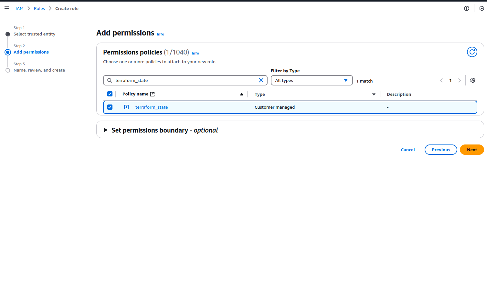

# Terraform State

AWS S3 is used as backend to store the terraform state. If you preffer a [different backend](https://developer.hashicorp.com/terraform/language/backend) please refer to  [terragrunt](https://terragrunt.gruntwork.io/docs/features/state-backend/) documentation.
You will need to modify the remote_state code in the parent `terrarunt.hcl` file. 

## Github Secrets
Github runners need permissions to create an AWS S3 bucket where they store & retrieve the terraform state,we do it using [OpenID Connect](https://docs.github.com/en/actions/security-for-github-actions/security-hardening-your-deployments/configuring-openid-connect-in-amazon-web-services)

We will need first to create 3 repository secrets in Github which will be used to create an AWS S3 bucket to store the terraform state.

**AWS_ACCOUNT_ID**:  Your AWS ACCOUNT ID.  
**AWS_REGION**: The AWS Region you want the bucket to be created.  
**AWS_S3_BUCKET**: The AWS S3 bucket name.  


## IAM Policy

First we need to create an IAM Policy with the following permissions attached. Those are the permissions that the github runners will get when they assume the IAM role we are going to create later.

:::info
    Do not forget to replace the Resource strings to include your bucket name from the previous step.
:::
```
{
    "Version": "2012-10-17",
    "Statement": [
        {
            "Sid": "VisualEditor1",
            "Effect": "Allow",
            "Action": [
                "s3:*",
                "s3:CreateBucket"
            ],
            "Resource": [
                "arn:aws:s3:::terraform-state-kickstart-demo/*", 
                "arn:aws:s3:::terraform-state-kickstart-demo*"
            ]
        }
    ]
}
```


## IAM Role

Then we create a new IAM Role called **github-oidc** with the following **Custom Trust Policy**.

```
{
    "Version": "2012-10-17",
    "Statement": [
        {
            "Effect": "Allow",
            "Principal": {
                "Federated": "arn:aws:iam::123456789000:oidc-provider/token.actions.githubusercontent.com"
            },
            "Action": "sts:AssumeRoleWithWebIdentity",
            "Condition": {
                "StringEquals": {
                    "token.actions.githubusercontent.com:aud": "sts.amazonaws.com"
                },
                "StringLike": {
                    "token.actions.githubusercontent.com:sub": [
                        "repo:homelabs757/my-selfhosted-services:*"
                    ]
                }
            }
        }
    ]
}
```

:::info
    Replace the AWS Account ID in Principal with your AWS account ID and also the repository with your own repository.
:::


Press next and in the **Add Permissions** select the IAM policy you created earlier. Give a new to the IAM role and press Create.


:::info
    Make sure the name of the role is **github-oidc** otherwise is not going to work.
::: 


## Identity Provider

Create a new Identity Provider of type "OpenID Connect" with the following Provider URL and Audience.  
**Provider URL:** `https://token.actions.githubusercontent.com`  
**Audience:** `sts.amazonaws.com`  


