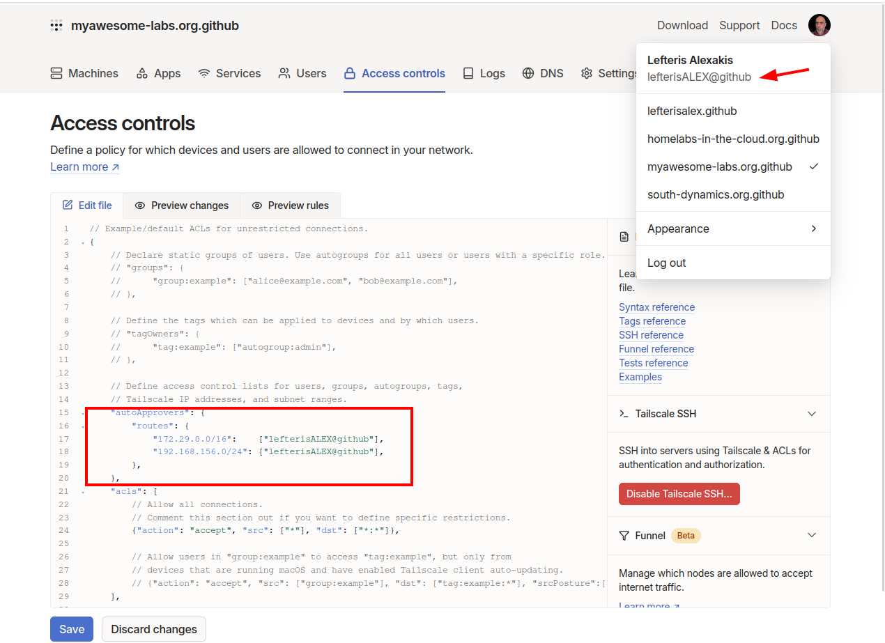
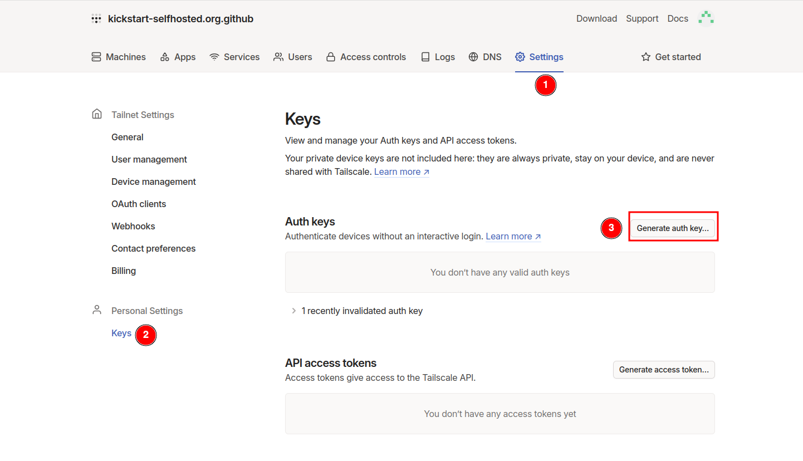
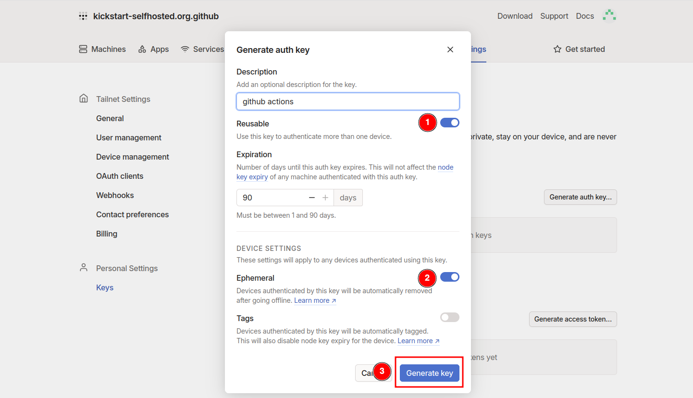

# VPN

We are using Tailscale as a VPN service. Tailscale is mesh VPN network which allows devices to connect securely and directly over the internet, using the WireGuard protocol
We are using Tailscale so you can connect your mobile device to the tailscale network, so you can securely access your selfhosted services from anywhere.
You can also connect add a home router to the tailscale so you can allow all devices in your home network to reach the selfhosted services.

## Before you login

If you want other people to use your services is better to create a [github organization](http/docs.github.com/en/organizations/collaborating-with-groups-in-organizations/creating-a-new-organization-from-scratch), and invite those people in that organization.
That way other people can also connect to your tailscale network , so they can access your services.
You can create a github organization by clicking on your icon in top right corner and select **"Your Organizations"**  and then click on **"New Organization"**

## First time login
Login to [tailscale](http/login.tailscale.com/) using Github as Identity Provider (select then the organization if you created).   
After you login make sure you change the account to **Personal Usage**.


## Access Control

**Why we need this?**  
During the bootstrap process of our VPS in Hetzner, we will install the Tailscale client and configure it to join our Tailscale network using a generated API key (will do that later). This setup in addition allows the VPS to advertise specific routes, enabling it to route traffic to specific IP subnets.  
In our configuration, the VPS will advertise both the private subnet in Hetzner and the Docker subnet. By default, Tailscale requires manual approval for these advertised routes each time a new device joins the network, so for example each time we replace the VPS. This means that whenever we replace the VPS, we would need to perform this manual step again.
To streamline this process, we can implement auto-approvers in the Access Control settings of Tailscale. This feature allows us to automatically approve certain routes for specific users, eliminating the need for manual intervention each time a new host connects to the Tailscale network. By setting up auto-approvers, we can ensure that the necessary routes are approved seamlessly, enhancing the efficiency of our network management.


Go to tab `Access Controls` and add the folllowing snippet to auto approve the routes that are advertised by tailscale.

```
	"autoApprovers": {
		"routes": {
			"172.29.016":    ["username@github"],
			"192.168.15624": ["username@github"],
		},
	},
```

The default settings of the module we are deploying have:  
Docker Network: `172.29.016`  
Hetzner Network: `192.168.15624`  

:::info
If you have changed the default subnets for the docker and hetzner network you will need to update the snippet accordingly.  
You need also to replace username@github with your username.
:::



## Generate Auth Key
Navigate to `Settings -> Personal Settings -> Keys` and press **Generate an auth key**.  



In the options choose to be reusable and ephemeral.



Store the token as a [GitHub secret](../../Getting_Started/preparation/cicd#github-secret) in your repository under the name `TAILSCALE_AUTH_KEY`

