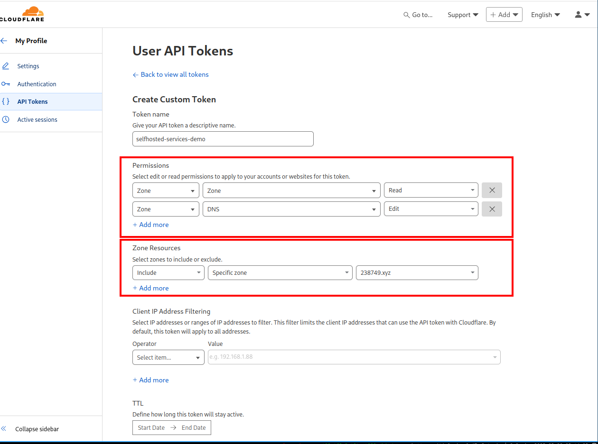

# DNS & TLS certificates

We are using Cloudflare to manage the DNS zone and Let's Encrypt for managing the TLS certificates. The following guide is going though the required steps that you will need before you first run your pipeline to deploy your selfhosted services. 

To complete this step you will need to have a domain (or subdomain) with an A record pointing to your Private IP of your hetzner server.
Additionally LetsEncrypt is managing the rotation of the TLS certificate , using DNS challenge. 

:::tip
   A cheap option for domains is to get a numbers only xyz domain, for example 123456.xyz, this cost less of a Euro per year. 
:::

### Add a domain
In the account home page select `add a domain`. 

  

And then select to **Manually enter DNS records**


Enter a [wildcard DNS](https://developers.cloudflare.com/dns/manage-dns-records/reference/wildcard-dns-records/#create-a-wildcard-record) A record to point to the private IP of the virtual machine in Hetzner.  

**Type:** `A`  
**Name:** `*`  
**Content:** `192.168.156.100`  
**Proxy Status:** Disabled 

:::info
    The default IP is `192.168.156.100` , if you have changed that you need to set the new IP here.
:::


You will see now very likely that the domain is pending activation. This is because you have acquired the domain from a different registar and not Cloudflare.


You will need to go to your domain registar and update the nameservers to use the Cloudflare Nameservers.
```
alexa.ns.cloudflare.com
jack.ns.cloudflare.com
```


In [this](https://developers.cloudflare.com/dns/nameservers/update-nameservers/#your-domain-uses-a-different-registrar) page you can find information how to change the Nameservers in a list of domain registars.  

Below an example of the required change in case you purchased the domain through [namecheap.com](https://www.namecheap.com/).


## Generate API key

**Why we need that?**  
In our setup we are using Let's Encrypt to get certificates. Let's Encypt servers need to verify first that you own the domain before they provide you the signed certificate.  
This can be done with [three methods](https://letsencrypt.org/docs/challenge-types/).
1. HTTP challenge
2. DNS challenge
3. TLS-SNI

We will be utilizing the DNS challenge, which requires our reverse proxy (Traefik) to have permissions to create TXT records in Cloudflare for your domain. To facilitate this, we will generate an API key with the necessary permissions. In the subsequent step, we will configure this API key as an external secret, allowing it to be accessed by the Traefik container.

To create an API token with the following permissions for your zone.

1. Go to Profile -> API Tokens -> Create Token -> Create Token -> Create Custom Token


2. Add the following permissions:  
`Zone -> Zone -> Read` & `Zone -> DNS -> Edit` .  
Then select specific zone  and select your domain and press **Continue to Summary**. 



3. Copy the generated API token , you will need it for the next step

