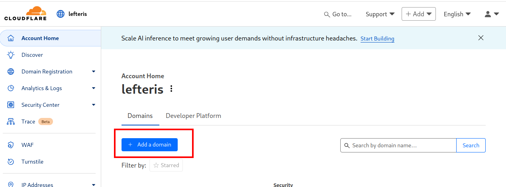
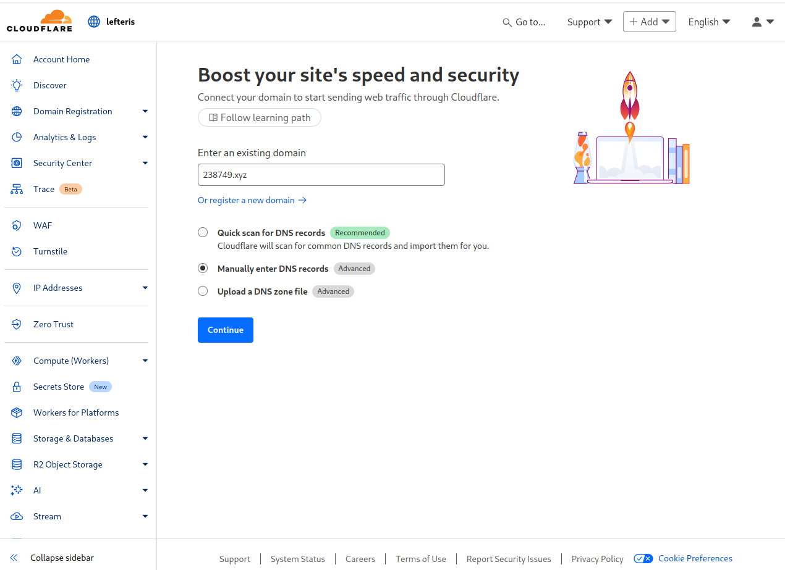
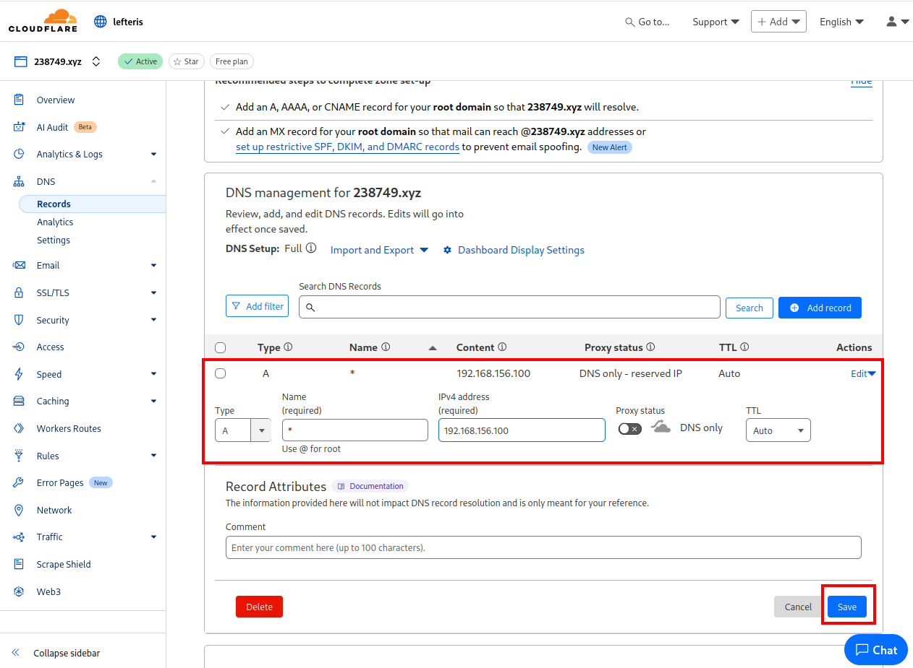
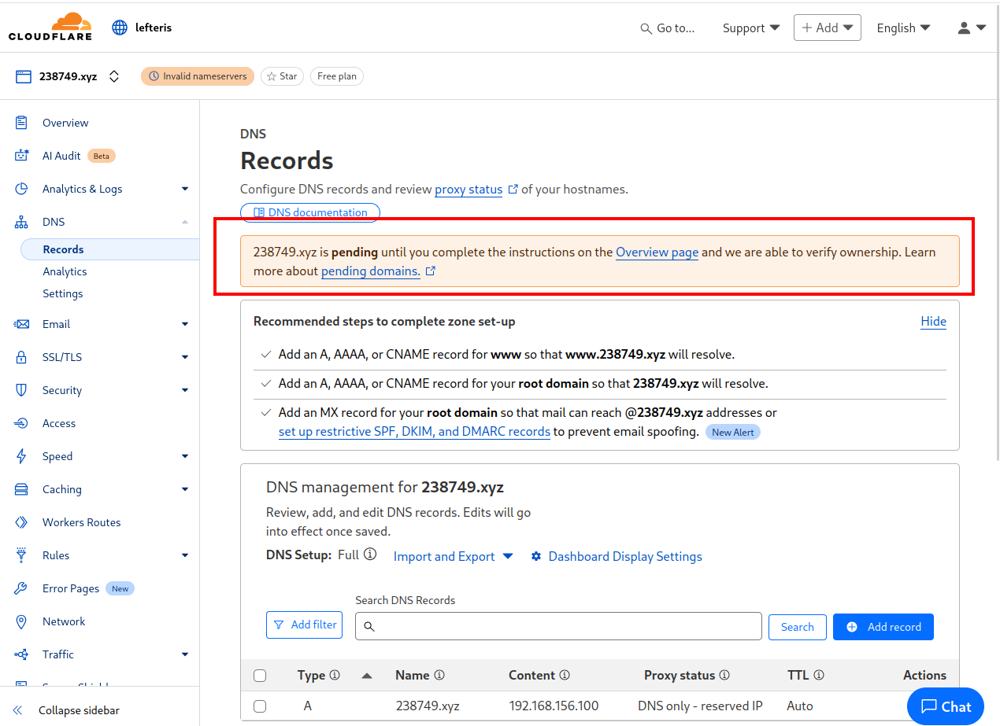
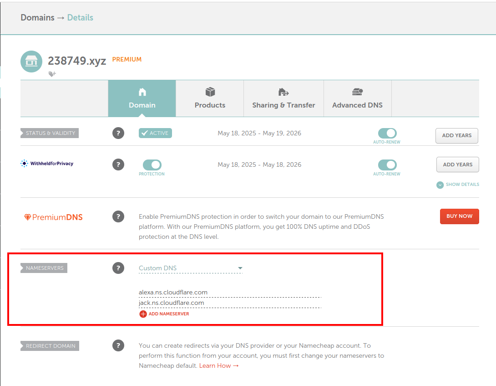
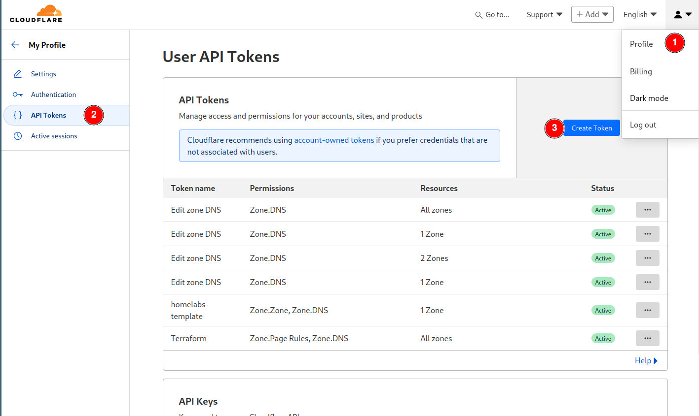
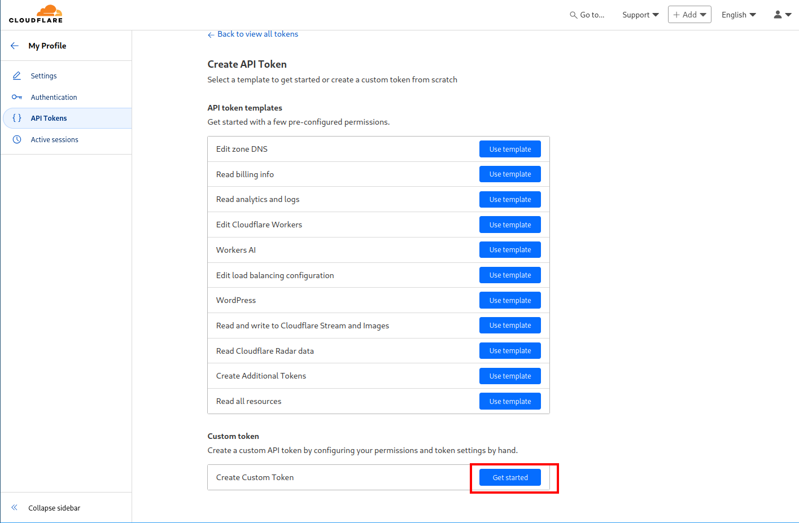
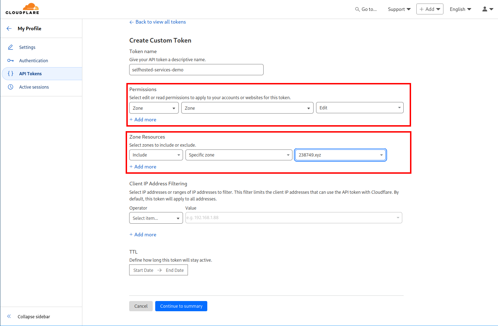

# Cloudflare

The following guide is going though the required preparation steps that you will need before you first run your pipeline to deploy your selfhosted services. 

## Cloudflare

You will need to have a domain (or subdomain) with an A record pointing to your Private IP of your hetzner server.
Additionally LetsEncrypt is managing the rotation of the TLS certificate , using DNS challenge. 

### Add domain
In the account home page select `add a domain`. 

  

And then select to **Manually enter DNS records**


Enter an A record to point to the private IP of the virtual machine in Hetzner. The default IP is `192.168.156.100` , if you have changed that you need to set the new IP here.
Remember to disable the Proxy status to DNS only.



You will see now very likely that the domain is pending activation. This is because you have acquired the domain from a different registar and not Cloudflare.



You will need to go to your domain registar and update the nameservers to use the Cloudflare Nameservers.
```
alexa.ns.cloudflare.com
jack.ns.cloudflare.com
```


In the following page you can find information how to change the Nameservers in a list of domain registars.  
https://developers.cloudflare.com/dns/nameservers/update-nameservers/#your-domain-uses-a-different-registrar

Below an example of the required change in case you purchased the domain through namecheap.



for that you will need to create an API token with the following permissions for your zone.
1. Go to Profile -> API Tokens -> Create Token -> Create Token -> Create Custom Token





2. Add Permissions Zone -> Zone -> Read & Zone -> DNS -> Edit . Then select specific zone  and select your domain and press Continiue to Summary. 


3. Take the generated API token and place it in infisical in a new directlry called traefik. The secret name should be `CF_DNS_API_TOKEN` and the value the token that was generated in cloudflare.

