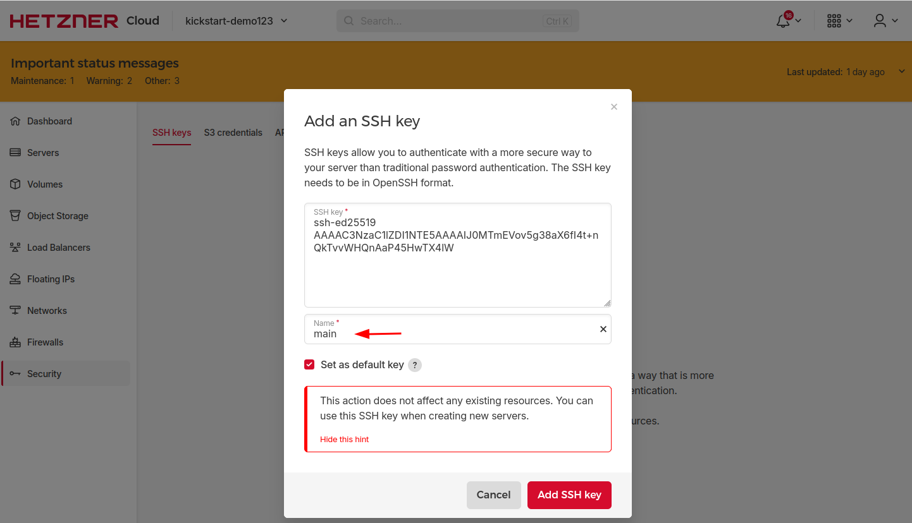

## Create a new proect

In [Hetzner Console](https://console.hetzner.cloud/projects) we will need to create a new proect where all our resources will be deployed.  
To do that we click on **"+ New Project"** and give it a name of your choice.

## Upload our SSH public key

**why we need this?**  
This key will be added in `~/.ssh/authorized_keys` of the VPS and will allow us to connect through SSH to the remote machine.
If you want to learn more about how to generate an SSH keypair please check [here](https://community.hetzner.com/tutorials/add-ssh-key-to-your-hetzner-cloud)

In the project you just created under **"Security"** press **"Add SSH key"** and paste your SSH public key. 

:::info
    Naming the SSH key main will not require changes in the terraform module since is the default key which will be looked up. 
:::

## Generate an API token

**why we need this?**  
An API token can give certain permissions in the project, for example create a new VPS. We will need to generate an API token and store it as secret in Github reposiroty secrets so can be used during the pipeline execution to deploy the required infrastructure.

In the newly created project under **Security** -> **API Tokens** click on **generate API token** with Read & Write permissions 

Store the token as a [GitHub repository secret](Github#github-secret) in your repository under the name `HCLOUD_TOKEN`

