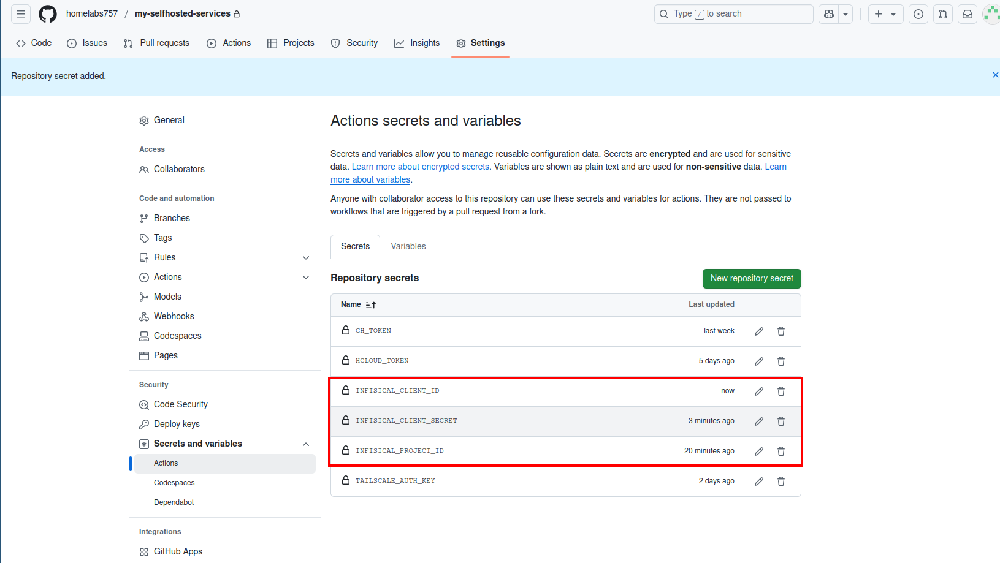

# Infisical

## Infisical

There are stored all secrets related with your applications.  

1. Create a project and save the project ID as github secret with name `INFISICAL_PROJECT_ID`

2. Navigate to `Admin` -> `Access Control` -> `Identities` .  
Press "Create Identity" and select as `Member` as Role

3. Press `Universal Auth` and then press `Add client secret`. Give it a name and press Create. Save the generated client secret as github secret with name `INFISICAL_CLIENT_SECRET`

4. Copy the `Client ID` and save it as github secret with name `INFISICAL_CLIENT_ID`  

Now you should have 3 new secrets stored in github related with Infisical.

5. Assign the new identity as Project Viewer

