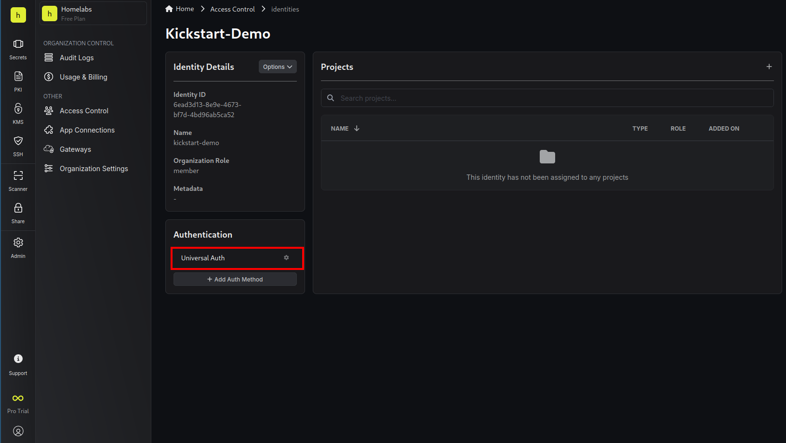
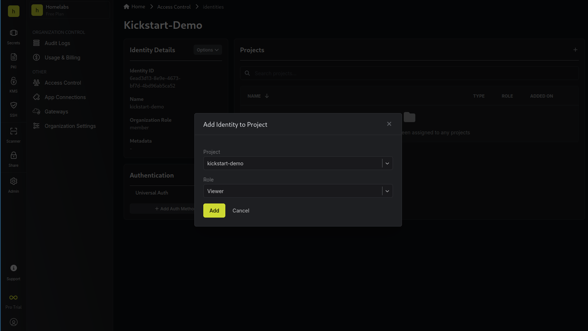

# External Secrets

We are using [Infisical](https://infisical.com/) to securely store all secrets related to your applications. Those secrets are pulled periodically (every 3 minutes) and can be used from the containers.

## Create a Project
First thing is that we need to create a new project and save the project ID as github secret with name `INFISICAL_PROJECT_ID`

## Create Identity
Navigate to `Admin` -> `Access Control` -> `Identities` .  
Press **"Create Identity"** and select as **"Member"** as Role

Then press `Universal Auth` and after press `Add client secret` , give it a name and press **"Create"**. Save the generated client secret as github secret with name `INFISICAL_CLIENT_SECRET`

Copy the `Client ID` and save it as github secret with name `INFISICAL_CLIENT_ID`  

Now you should have 3 new secrets stored in github related with Infisical.

Lastly assign the new identity as Project Viewer

## Add required secrets

Is important first to understand how the secrets are copied in to the VPS first, if you haven't done already take a look first in [how it works](../how_it_works.md) section.

We need to create 3 secrets in order to be able to complete the DNS challenge, we can create those secrets by pressing the **"Add Secret"** button.

**DOMAIN:** The domain name for which you want to enable TLS. In this example `238749.xyz`

To create the secret we click on **"Add secret"** button and fill the `Key` `Value` and `Environments` where this secret will be available.

:::note
    Make sure all secrets are available for Production environment since the deployr script that downloads the secrets is looking for the secrets available for Production Environment only
:::

**EMAIL:** The email address which will provided to Let's Encrypt.

**CF_DNS_API_TOKEN**: The API token you generated in your Cloudflare account from the previous step. This token will be used to authenticate API requests to manage DNS records. This secret should be created inside a directory called `traefik`, since should be available only in the traefik container.

