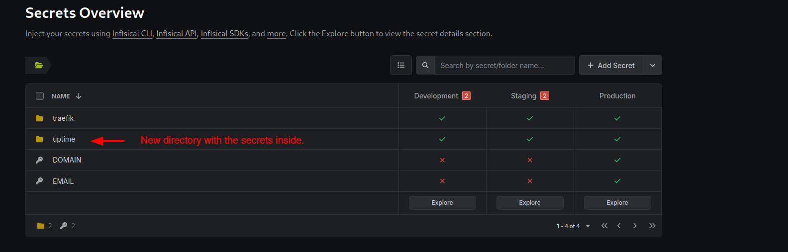

# Add more services

You can include any `docker-compose.yaml` file in your apps directory if you want to inlude it in the stack. There are some steps you will need to be aware you need to do in order to run properly.  
You will have to:
1. **update the root docker-compose.yaml** to include the new `docker-compose` file.
2. **Update the volumes** of the docker-compose to point to a path under `/mnt/data` if you want your data to be persistant.
3. Add the **containers to the `private_network`** so is in the same network as the other containers.
4. Add the **traefik labels** if you want to expose your service.
5. Add the **docker-volume-backup labels** if you want the container to be stopped when the backup is taken
6. **Include the `.secrets` file**, if you want to read the secrets from infisical an environment variables.

:::tip
    A very good starting point to find docker-compose.yaml files for almost any service you want to self host is the [awesome-selfhosted](https://github.com/awesome-selfhosted/awesome-selfhosted) repository.
:::

As an example let's say we want to deploy **uptime-kuma** based on the `docker-compose.yaml` as found in uptime github [repository](https://github.com/louislam/uptime-kuma/blob/master/compose.yaml).
```yaml
services:
  uptime-kuma:
    image: louislam/uptime-kuma:1
    volumes:
      - ./data:/app/data
    ports:
      # <Host Port>:<Container Port>
      - 3001:3001
    restart: unless-stopped
```


We need first to place this file under `containers-host/apps/uptime/docker-compose.yaml` file. The new structure should look now like:

```
├── docker-compose.yaml
├── .env # This file will contain the secrets highlighted above
├── traefik
│   └── docker-compose.yaml
├── uptime
│   └── docker-compose.yaml
└── dashy
    └── docker-compose.yaml

```
## update the root docker-compose

```yaml
version: "3"
include:
  - ./traefik/docker-compose.yaml
  - ./docker-backup/docker-compose.yaml
  - ./dashy/docker-compose.yaml
  # Add the line below to include the uptime-kuma docker-compose
  - ./uptime/docker-compose.yaml
networks:
  private_network:
    name: private_network
    driver: bridge 
    ipam:
      config:
        - subnet: 172.29.1.0/24
```
##  Update the volumes
The config volume is the one we want to store in the persistant data. So we are going to update the `docker-compose.yaml` to look like:

```yaml
services:
  uptime-kuma:
    image: louislam/uptime-kuma:1
    volumes:
      - /mnt/data/uptime:/app/data
    ports:
      # <Host Port>:<Container Port>
      - 3001:3001
    restart: unless-stopped
```

## Update Network
We need to update the network so uptime-kuma container is running in the same network with the rest containers.


```yaml
services:
  uptime-kuma:
    image: louislam/uptime-kuma:1
    volumes:
      - /mnt/data/uptime:/app/data
    ports:
      # <Host Port>:<Container Port>
      - 3001:3001
    networks:
      - private_network
    restart: unless-stopped
```

## Add the traefik labels

To configure Traefik to route HTTPS traffic to the uptime-kuma service based on the specified host (uptime.your-domain), while also managing TLS certificates automatically through Let's Encrypt we need to add the following labels:

**traefik.enable**: This label enables Traefik for the uptime-kuma service. If this label is set to false, Traefik will ignore this service.
**traefik.http.routers.uptime.entrypoints**: This label specifies that the router for this service should listen on the websecure entry point.
**traefik.http.routers.uptime.rule**: It tells Trafik which domain requests to route to uptime-kuma services. If `${DOMAIN}` is example.com, then is going to route all requests to `uptime.example.com` to uptime-kuma service
**traefik.http.routers.uptime.tls.certresolver**: This label indicates which resolved Traefik should use to automatically obtain and manage TLS certificates for this service. 
**traefik.http.routers.uptime.tls**: If true it explicitly enables TLS for the router, ensuring that the service is served over HTTPS.

```yaml
services:
  uptime-kuma:
    image: louislam/uptime-kuma:1
    labels:
      - "traefik.enable=true"
      - "traefik.http.routers.uptime.entrypoints=websecure"
      - "traefik.http.routers.uptime.rule=Host(`uptime.${DOMAIN}`)"
      - "traefik.http.routers.uptime.tls.certresolver=letsencrypt"
      - "traefik.http.routers.uptime.tls=true"
    volumes:
      - /mnt/data/uptime:/app/data
    networks:
      - private_network
    restart: unless-stopped
```

## Add the backup labels
Since we are running already the docker-volume-backup container by default we might want to stop the containers when the backup is taken to ensure that backup integrity.  
To do that we can add the following label:
```
      - "docker-volume-backup.stop-during-backup=true"
```
The file should look now like this:  
```yaml
services:
  uptime-kuma:
    image: louislam/uptime-kuma:1
    labels:
      - "docker-volume-backup.stop-during-backup=true"
      - "traefik.enable=true"
      - "traefik.http.routers.uptime.entrypoints=websecure"
      - "traefik.http.routers.uptime.rule=Host(`uptime.${DOMAIN}`)"
      - "traefik.http.routers.uptime.tls.certresolver=letsencrypt"
      - "traefik.http.routers.uptime.tls=true"
    volumes:
      - /mnt/data/uptime:/app/data
    networks:
      - private_network
    restart: unless-stopped
```

## Include the secrets file

In some containers, it may be necessary to inject secrets, such as credentials for connecting to a database. There are various methods to achieve this, and in our case, we are utilizing Infisical to manage these secrets. The deployr script will retrieve the credentials stored in Infisical and create a file named `.secrets` in the same directory as the `docker-compose.yaml` file for the uptime-kuma service.
To begin, we need to add the required secrets to Infisical under a new directory `uptime`.



The deployr script will then access all secrets within this `uptime` directory and generate the `.secrets` file in the `uptime` subdirectory of the apps directory, which is the same location as the uptime-kuma `docker-compose.yaml` file.


```yaml
├── docker-compose.yaml
├── .env 
├── traefik
│   └── docker-compose.yaml
├── uptime
│   ├── docker-compose.yaml
│   └── .secrets # This file will contain the secrets for the uptime service
```
Once the `.secrets` file is created, the `env_file` directive in the `docker-compose.yaml` can be used to make these key-value pairs available as environment variables within the container.

```yaml
services:
  uptime-kuma:
    image: louislam/uptime-kuma:1
    env_file:
      - .secrets
    labels:
      - "docker-volume-backup.stop-during-backup=true"
      - "traefik.enable=true"
      - "traefik.http.routers.uptime.entrypoints=websecure"
      - "traefik.http.routers.uptime.rule=Host(`uptime.${DOMAIN}`)"
      - "traefik.http.routers.uptime.tls.certresolver=letsencrypt"
      - "traefik.http.routers.uptime.tls=true"
    volumes:
      - /mnt/data/uptime:/app/data
    networks:
      - private_network
    restart: unless-stopped
```

