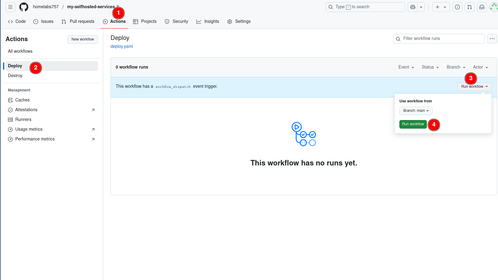
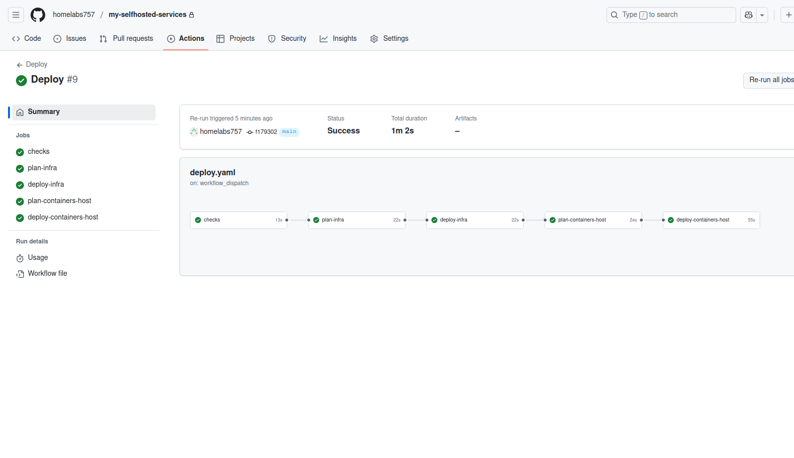
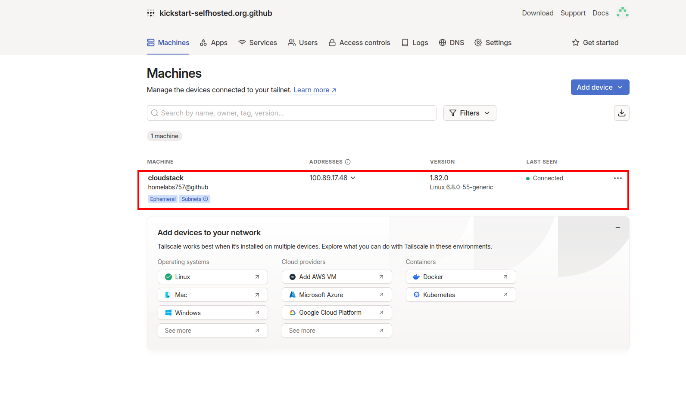
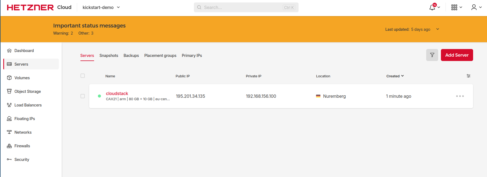

# Deploy Cloudstack 

After all pre-required steps are done you can deploy your stack by running the `Deploy` Github Action.

If all above steps are done properly the pipeline should be executed without issues.

If you login to tailscale you should be able to see your server be registered and connected to the tailscale network.

Also in Hetzner you should be able to see the server running.

