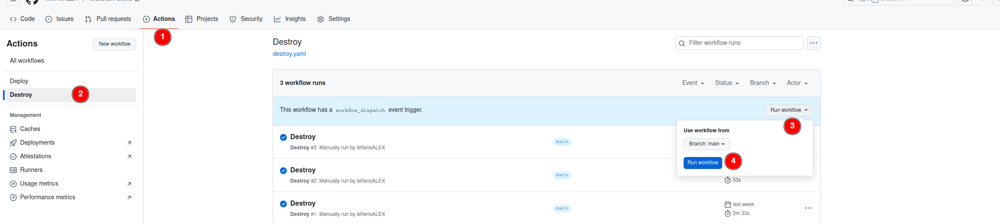

# Destroy
To destroy the infrastructure, you need to run the destroy pipeline. This action will remove all resources; however, please be aware that the pipeline will fail if delete protection is enabled for the data volumes. In such cases, if you run the deploy pipeline, your data stored in those protected volumes will remain intact.

:::tip
    If you wish to completely destroy all resources, including the volumes, you must first disable the delete protection on those volumes. To do that you first need to change the `volume_delete_protection` to false in `containers-host/terragrunt.hcl` file. Once delete protection is disabled, you can proceed with the destroy pipeline to remove everything.
