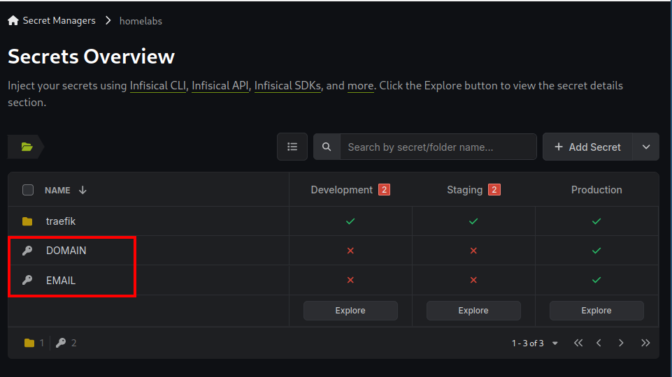

# How it works

## General idea

The objective is to establish a fully automated deployment process that provisions all necessary infrastructure and containers as specified in the docker-compose.yaml files through a continuous integration/continuous deployment (CI/CD) pipeline. Aside from a few manual steps outlined in the Preparation section, all configurations will be defined in code. 

## Containers Deployment

When the setup is deployed a VPS will be launched in Hetzner were your containers will run.
In this VPS your github repository will be also cloned under `/root/deployr/` 

### Deployr script

The deployr script is executed periodically (every 3 minutes) and taking care of the following actions:
1. Fetch latest code from your repository.
2. Fetch all secrets from your infisical project and save them locally in the VPS (see Secrets section below for more info)
2. If there is any new commit detected then `docker compose up -d /root/deployr/containers-host/apps/docker-compose.yaml` is executed 

### Docker-compose structure
Instead of having a large `docker-compose.yaml` file where we define all the services, we use instead the `include` command to split the configuration in multiple files.

Below a structure of the folder `containers-host/apps` in your repository.

```
├── docker-compose.yaml
├── traefik
│   └── docker-compose.yaml
└── uptime
    └── docker-compose.yaml
```
#### root docker-compose file
In this structure there is a main `docker-compose.yaml` file which is used to configure:
1. Which other `docker-compose.yaml` files should be included, so in other words which other services should be enabled.
2. The docker network name and subnet.

example of a root `docker-compose.yaml` file

```
version: "3"
include:
  - ./traefik/docker-compose.yaml
  - ./docker-backup/docker-compose.yaml
  - ./dashy/docker-compose.yaml
  - ./uptime/docker-compose.yaml
networks:
  private_network:
    name: private_network
    driver: bridge
    ipam:
      config:
        - subnet: 172.29.1.0/24
```

#### application specific docker-compose file

All applications in this example (traefik/docker-backup/dashy/uptime) should have then their own dedicated  `docker-compose.yaml` file under a specific directory.  
For instance for the traefik application the `docker-compose.yaml` is the `traefik/docker-compose.yaml`

```
version: "3.8"

name: traefik

services:
  traefik:
    image: traefik:v3.3
    container_name: traefik
    ports:
      - 80:80
      - 443:443
      - 8080:8080
    networks:
      private_network:
    env_file:
      - .secrets
    volumes:
      - /var/run/docker.sock:/var/run/docker.sock:ro
      - /mnt/data/traefik/letsencrypt:/letsencrypt
    command:
      - "--api=true"
      - "--api.dashboard=true"
      - "--providers.docker=true"
      - "--providers.docker.exposedbydefault=false"
      - "--entrypoints.web.address=:80"
      - "--entrypoints.websecure.address=:443"
      - "--entrypoints.web.http.redirections.entryPoint.to=websecure"
      - "--certificatesresolvers.letsencrypt.acme.dnschallenge=true"
      - "--certificatesresolvers.letsencrypt.acme.dnschallenge.provider=cloudflare"
      - "--certificatesresolvers.letsencrypt.acme.email=${EMAIL}"
      - "--certificatesresolvers.letsencrypt.acme.storage=/letsencrypt/acme.json"
    labels:
      - "traefik.enable=true"
      - "traefik.http.routers.dashboard.entrypoints=websecure"
      - "traefik.http.routers.dashboard.tls.certresolver=letsencrypt"
      - "traefik.http.routers.dashboard.rule=Host(`dashboard.${DOMAIN}`) && (PathPrefix(`/api`) || PathPrefix(`/dashboard`))"
      - "traefik.http.routers.dashboard.service=api@internal"
    restart: always
```

## Persistent Storage

The setup provision a volume in Hetzner which is attached in the VPS under `/mnt/data`. Any data that need to persist is highly recommeneded to be stored there.
This can be done by mounting the path inside the container under `/mnt/data/application_name`.   
By storing persistent data in an external volume, the data remains unaffected by the lifecycle of the VPS. This means that if the VPS is replaced, the data in the external volume will not be lost. Additionally, the external volume comes with delete protection enabled by default, ensuring that it cannot be deleted without first disabling this protection.

:::tip
It is not necessary to store application-specific persistent data under the directory `/mnt/data/application_name`. For instance, Traefik's persistent data can reside in any subdirectory within /mnt/data. However, it is recommended to maintain a structured organization that suits your needs for better management and accessibility.
:::

## Secrets

### Infrastructure secrets
All secrets, except those use by the containers are storeed as [repository secrets in Github](Preparation/Github#github-secret), so they can be consumed during the execution of the pipeline.

### Application specific secrets


Secrets that need to be used inside the containers are stored as external secrets at [infisical](https://infisical.com/).
All secrets that are stored in the root directory of infisical are going to be stored in the VPS in an `.env` file along with the root `docker-compose.yaml` . That way those secrets will be available to all containers as environment variables.


```yaml
├── docker-compose.yaml
├── .env #This file will contain the secrets highlighted above
├── traefik
│   └── docker-compose.yaml
└── uptime
    └── docker-compose.yaml
```

:::info
    Downloading the secrets and storing them in the `.env` file is done by the deployr script and this action is executed periodically. 
:::


All secrets stored in Infisical under the `traefik` directory will be copied to the file `./traefik/.secrets`, making them accessible to the Traefik containers as defined in `./traefik/docker-compose.yaml`.


```yaml
├── docker-compose.yaml
├── .env
├── traefik
│   ├── docker-compose.yaml
│   └── .secrets #This file will contain the secrets highlighted above
└── uptime
    └── docker-compose.yaml
```
:::tip
    To create a `.secrets` file for each application, we can create a corresponding directory in Infisical with the same name. For example, to create a `.secrets` file for the `uptime` application, we need to create an `uptime` directory in Infisical and store the relevant secrets there. These secrets will then be saved in the file `./uptime/.secrets`.
:::
