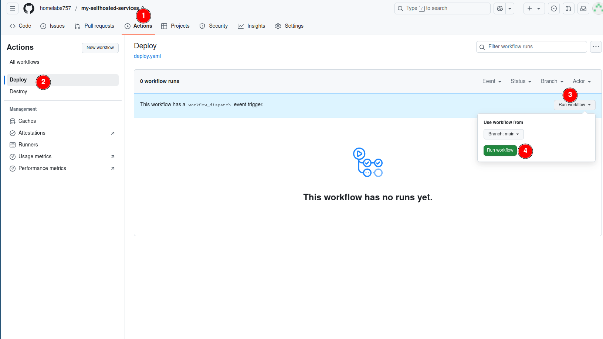
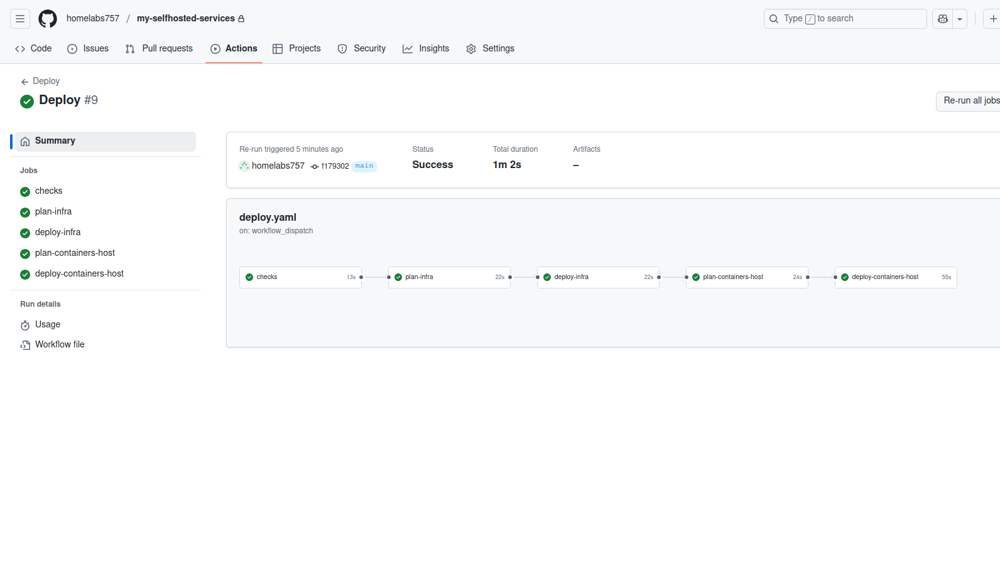
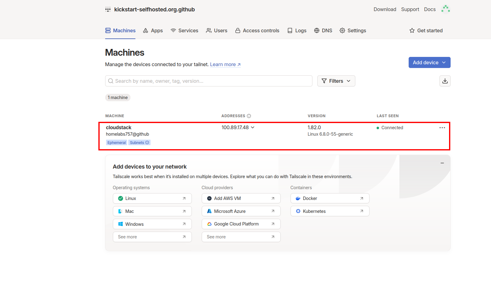
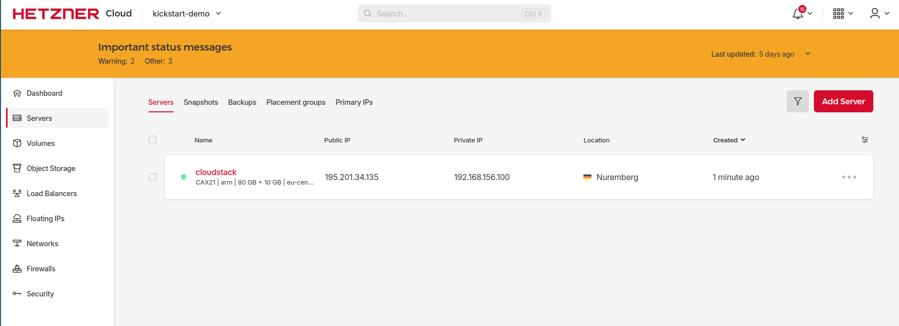
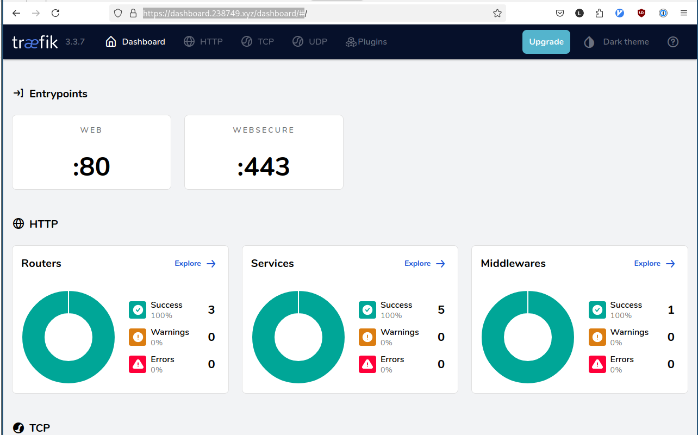

# Initial Deploy

After all pre-required steps are done you can deploy your stack by running the `Deploy` Github Action.

If all above steps are done properly the pipeline should be executed without issues.

If you login to tailscale you should be able to see your server be registered and connected to the tailscale network.

Also in Hetzner you should be able to see the server running.

If everything went smoothly you should be access the dashboard of traefik `https://dashboard.your-domain.com/dashboard/`  from any device connected to your tailscale network.
So in our example i was able to connect to `https://dashboard.238749.xyz/dashboard/`

:::warning
    The trailing slash / in /dashboard/ is mandatory
:::

